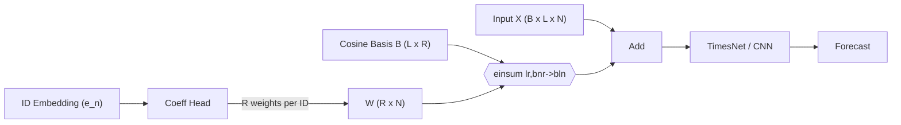

# Flow-TimesNet
**FFT-guided period selection + 2D Inception CNN + embedding-aware adaptive probabilistic head** for multivariate time-series forecasting.  
Keeps the canonical `[B, T, N] → [B, H, N]` interface while adding robust contextualization and calibrated uncertainty.

---

## TL;DR
- **Beyond vanilla TimesNet.** We preserve TimesNet’s FFT-to-2D idea but add: channel-robust *shared* period search, **PeriodGrouper** (merge penalized/duplicate periods), **rich embeddings** (IDs + statics + low-rank temporal context), and an **adaptive probabilistic head** (Negative Binomial with dispersion floors) for stability.
- **CNN synergy.** Embeddings lift semantic signal; the 2D Inception CNN captures intra-/inter-period structure; the probabilistic head calibrates rate/dispersion per series and horizon — *three gears meshing* for accuracy and robustness.
- **Direct & recursive.** Train once, forecast direct (`H` at once) or recursive (rolling one-step) with the same checkpoints.
- **Modular data I/O.** Input schemas and test loaders are fully pluggable. Swap CSV layouts, feature sets, and eval folds via config — no code surgery required.

---

# Low‑Rank Temporal Context: Turning Static Embeddings into Time‑Varying Signals

> **Why this matters**
> Injecting *static* per‑series information (IDs, categories) as a *dynamic* signal that evolves over time is notoriously hard.
> **`LowRankTemporalContext`** solves this with **low‑rank approximation**: a compact, principled way to compose per‑ID temporal background signals from a tiny set of shared basis waves.

---

## 1) Problem → Why naive approaches break

We add to each series a learned, time‑varying context:

$$
X'*{t,n} = X*{t,n} + S_{t,n}
$$

where $t\in{0,\dots,L-1}$ is time and $n\in{1,\dots,N}$ is the series ID.

**Naive plan:** learn every $S_{t,n}$ separately.
**Cost:** $L\times N$ parameters (per batch) → brittle and overfits.

| Approach                   |           Parameter scale | Generalization | Notes                                     |
| -------------------------- | ------------------------: | -------------- | ----------------------------------------- |
| Per‑timestep per‑ID table  |          $\mathcal O(LN)$ | ❌ poor         | Memorizes, no sharing                     |
| One shared temporal vector |           $\mathcal O(L)$ | ❌ ignores ID   | Misses heterogeneity                      |
| **Low‑rank (ours)**        | **$\mathcal O(LR + NR)$** | ✅ strong       | Shares *basis*, personalizes via *coeffs* |

With rank $R\ll L$, we reduce cost by orders of magnitude while keeping ID‑specific variation.

---

## 2) Key idea → Low‑rank temporal factorization

Assume each per‑ID context is a linear mix of a **small** set of shared basis signals ${b_r(t)}_{r=1}^R$:

$$
S_{t,n} \approx \sum_{r=1}^{R} w_{n,r}, b_r(t).
$$

Matrix view (dimensions in brackets):

$$
\mathbf S,[L \times N]  \approx  \mathbf B,[L \times R] \mathbf W,[R \times N].
$$

Here $\mathbf B$ are **shared** bases across IDs and $\mathbf W$ are **per‑ID** mixture weights.

---

## 3) Our construction → DCT‑like cosine bases + zero‑mean stabilization

### 3.1 Cosine basis (DCT‑II style)

For $t=0,\dots,L-1$ and $r=1,\dots,R$:

$$
b_r(t) = \cos\Big(\tfrac{\pi}{L},(t+\tfrac{1}{2}),r\Big).
$$

**Why cosine/DCT?** energy compaction, near‑orthogonality, FFT‑friendly numerics.

### 3.2 Zero‑mean constraint (optional, recommended)

We center each basis columnwise:

$$
\tilde{\mathbf B} = \mathbf B - \mathrm{mean}*{t}(\mathbf B),\quad \text{so}\quad \mathrm{mean}*{t}(\tilde{\mathbf B},\mathbf W) \approx \mathbf 0.
$$

**Effect:** the context **modulates patterns** without drifting the global scale/level of $X$.

> **Tip:** Use zero‑mean when you want to shape temporal texture (seasonality, pulse, curvature) but not bias levels. Turn it off only if you explicitly want baseline shifts.

---

## 4) From embeddings to per‑ID mixtures

Each series has a static embedding $\mathbf e_n\in\mathbb R^{d}$. We predict mixture coefficients via a small head:

$$
\mathbf w_n = \mathrm{Linear}(\mathbf e_n) \in \mathbb R^{R}.
$$

Minimal, fast, and expressive enough to map “who you are” → “how your context sounds.”

---

## 5) Batched synthesis in PyTorch 

Let $\texttt{basis}\in\mathbb R^{L\times R}$ (shared), $\texttt{coeff}\in\mathbb R^{B\times N\times R}$ (from embeddings), and output $\texttt{context}\in\mathbb R^{B\times L\times N}$. We compute

```python
# LowRankTemporalContext.forward (conceptual)
context = torch.einsum("lr,bnr->bln", basis, coeff)  # S_{t,n} = sum_r w_{n,r} * b_r(t)
x_out   = x_in + context
```

Dims: $l=L$ (length), $r=R$ (rank), $b=B$ (batch), $n=N$ (num series/channels).

---

## 6) Complexity & capacity

* **Params:** $L\times R$ (basis, fixed or learnable) + affine $d\times R$ (coeff head).
* **FLOPs:** $\mathcal O(B,L,N,R)$ (einsum), linear in rank $R$.
* **Memory:** $\mathbf B$ is shared; $\mathbf W$ computed on the fly from embeddings.

| Knob       | Role                         | Rule of thumb                                             |
| ---------- | ---------------------------- | --------------------------------------------------------- |
| Rank $R$   | richness of temporal palette | start $R\in[4,16]$; increase if underfitting              |
| Zero‑mean  | level‑stability              | on for pattern‑only; off to adjust baselines              |
| Basis type | prior over shapes            | Cosine/DCT for smoothness; Spline/learned for flexibility |
| Coeff head | ID→mix mapping               | Linear is robust; MLP if highly nonlinear IDs             |

---

## 7) How it integrates with TimesNet/CNN backbones

`LowRankTemporalContext` **pre‑conditions** the input with ID‑aware, time‑varying structure:



* **Before** temporal blocks: inject smooth, ID‑specific rhythms that align with periodic convolutions/2D kernels.
* **Effect:** CNN/TimesNet layers spend less capacity rediscovering obvious ID‑periodicity; they focus on higher‑order interactions and residuals.

---

## 8) Math summary 

$$
\begin{aligned}
&\textbf{Goal:}\quad X'*{t,n} = X*{t,n} + S_{t,n},\quad S_{t,n} \approx \sum_{r=1}^{R} w_{n,r}, b_r(t). \\
&\textbf{Cosine basis:}\quad b_r(t) = \cos\Big(\tfrac{\pi}{L}(t+\tfrac{1}{2})r\Big). \\
&\textbf{Zero‑mean:}\quad \tilde{\mathbf B} = \mathbf B - \mathrm{mean}*{t}(\mathbf B),  \Rightarrow  \mathrm{mean}*{t}(\tilde{\mathbf B},\mathbf W) \approx \mathbf 0. \\
&\textbf{Embedding→mixture:}\quad \mathbf w_n = \mathrm{Linear}(\mathbf e_n) \in \mathbb R^{R}. \\
&\textbf{Matrix summary:}\quad \mathbf S \approx \tilde{\mathbf B},\mathbf W  \Longleftrightarrow  S_{t,n} \approx \sum_{r=1}^{R} w_{n,r}, \tilde b_r(t). \\
\end{aligned}
$$

---

## 9) API sketch (reference)

```python
class LowRankTemporalContext(nn.Module):
    def __init__(self, length: int, rank: int, embed_dim: int,
                 zero_mean: bool = True, learn_basis: bool = False):
        super().__init__()
        self.length, self.rank = length, rank
        # (A) Shared temporal basis B ∈ ℝ^{L×R}
        B = self._cosine_basis(length, rank)  # DCT-II grid
        if zero_mean:
            B = B - B.mean(dim=0, keepdim=True)
        self.basis = nn.Parameter(B, requires_grad=learn_basis)

        # (B) ID-embedding → R weights
        self.context_coeff = nn.Linear(embed_dim, rank)

    @staticmethod
    def _cosine_basis(L, R):
        t = torch.arange(L).float().unsqueeze(1)        # [L,1]
        r = torch.arange(1, R+1).float().unsqueeze(0)   # [1,R]
        return torch.cos(math.pi / float(L) * (t + 0.5) * r)  # [L,R]

    def forward(self, x: torch.Tensor, id_embed: torch.Tensor):
        """
        x:        [B,L,N]  (time-major)
        id_embed: [B,N,D]  (static embeddings per series)
        """
        coeff = self.context_coeff(id_embed)            # [B,N,R]
        context = torch.einsum("lr,bnr->bln", self.basis, coeff)
        return x + context, context
```

---

## 10) Practical guidance

* **Initialization:** keep `learn_basis=False` first; let the linear head learn mixtures on a *fixed* palette.
* **Regularization:** mild weight decay on the coeff head; optional $\ell_2$ on coefficients to avoid over‑energetic contexts.
* **Sanity checks:** plot a few ${b_r(t)}$ and sampled $S_{t,n}$; verify $\mathrm{mean}*{t}(S*{t,n})\approx0$ when zero‑mean is on; ablate $R$ for diminishing returns.
* **When to increase $R$:** multi‑scale seasonality (daily/weekly), heterogeneous venues/menus, long horizons.
* **When to learn the basis:** if domain rhythms differ from cosines (e.g., holiday pulses, regime switches). Consider piecewise or spline bases.

---

## 11) Empirical playbook 

1. **Baseline:** model w/o context.
2. **+ Low‑rank context:** $R=8$, zero‑mean on, fixed DCT basis.
3. **Rank sweep:** $R\in{4,8,12,16}$.
4. **Basis ablation:** fixed DCT vs learnable basis.
5. **Downstream impact:** check sMAPE/NLL deltas, especially on sparse/volatile IDs.

| Setting                 | sMAPE ↓ | NLL ↓ | Notes                      |
| ----------------------- | ------: | ----: | -------------------------- |
| Baseline                |       — |     — | reference                  |
| + LowRank (R=8)         |   **↓** | **↓** | best cost/benefit          |
| + Learnable basis (R=8) |       ↓ |     ↓ | may improve, watch overfit |
| + High rank (R=32)      |       ~ |     ~ | risk: diminishing returns  |

---

## 12) Why this is *not* a hack but a principle

1. **Parsimony:** replaces $\mathcal O(LN)$ free knobs with $\mathcal O(LR+NR)$ structured ones.
2. **Inductive bias:** smooth, near‑orthogonal atoms match the physics of seasonal/slow dynamics.
3. **Composability:** cleanly adds to any sequence backbone (TimesNet, CNNs, Transformers).
4. **Controllability:** zero‑mean switch separates *pattern* shaping from *level* shifting.

---

## Why This Differs From “Vanilla” TimesNet

**Vanilla TimesNet (paper-style):** reshape a 1D series into a 2D period-phase grid chosen by **FFT**, then apply **2D CNN** blocks to capture **intra-period** (phase) and **inter-period** (cycle) patterns.

**This repo extends that design** in three principled ways:

1. **Embedding-aware context**
   - **Value + positional + (optional) time features** with configurable normalization (LayerNorm/RMSNorm/decoupled).
   - **Series ID embeddings** and **static covariates** projected/fused into a **context vector**.
   - **Low-Rank Temporal Context (LRTC)** injects a compact learned basis over time so static info can modulate temporal dynamics.

2. **Robust, shared FFT period search**
   - **Channel-median** magnitude with **batch averaging**, **DC removal**, and **log-penalty** for long periods to avoid spurious peaks.
   - **PeriodGrouper** merges near-duplicate periods (log buckets, min-cycle guards), producing stable, *soft-weighted* candidates for CNN processing.

3. **Adaptive probabilistic head**
   - **Negative Binomial (`rate`, `dispersion`)** with `min_sigma`/per-series floors to keep dispersion positive on sparse demand.
   - Heads are AMP-safe; outputs are masked at invalid points.

**Net effect:** Embeddings raise *semantic SNR*, **2D Inception CNN** exploits *phase-by-cycle* structure, and the **probabilistic head** adapts level/dispersion per series — a synergistic trio that outperforms naively stacked modules.

---
## Architecture Overview

- **DataEmbedding**: value + positional + optional time features; integrates **ID & static** embeddings and **LRTC**.  
- **FFTPeriodSelector**: channel-robust spectrum summary → top-k frequencies (DC removed, long-period damped) → period lengths (≥2 cycles).  
- **PeriodGrouper**: merges close periods, yields logits for **softmax weighting**.  
- **TimesBlock (2D Inception CNN)**: reshape `[B,T,N]` to period grids, apply **multi-kernel Inception** with bottlenecks, compute residuals, then **weighted sum across periods**.  
- **Forecast head**: time projection to horizon `H`, plus **Negative Binomial** rate/dispersion heads with stability floors.
- **Training**: NB-NLL (**default**) with AMP-safe masking; supports **direct** and **recursive** decoding; logs **sMAPE/NLL** and coverage.

---

## Installation

```bash
# Python ≥ 3.10; PyTorch ≥ 2.1 recommended
pip install -r requirements.txt
# Optional: CUDA/cuDNN for GPUs; AMP is supported
```
---

## Quickstart (CLI)

```bash
Initiate(Colab)

!git clone https://github.com/ShinDongWoon/Recursive-TimesNet.git
%cd Recursive-TimesNet
!pip install -r requirements.txt
!pip install -e .

# Train
python -m timesnet_forecast.cli train \
  --config configs/default.yaml \
  --override train.lr=1e-3 window.input_len=336 window.pred_len=24

# Predict (direct or recursive; controlled by config)
python -m timesnet_forecast.cli predict --config configs/default.yaml

# Hyperparameter search (Optuna)
python -m timesnet_forecast.cli tune \
  --config configs/default.yaml \
  --space  configs/search_space.yaml
```
---
## Recursive-TimesNet Dataset Usage Guide

### 1. Training Data (`data/train.csv`)
- **Structure**: A single CSV file consisting of three columns: `영업일자` (business date), `영업장명_메뉴명` (store-menu identifier), and `매출수량` (sales quantity).
- Each row represents the sales quantity for a specific (date, store-menu combination), providing the date in `YYYY-MM-DD` format and an integer sales quantity.
- The file is saved in **UTF-8 with BOM**, so BOM handling should be considered when reading it in environments like Python.

### 2. Evaluation Data (`data/test/TEST_*.csv`)
- Consists of **10 files in total**, from `TEST_00.csv` to `TEST_09.csv`, all using the same schema.
- The column structure is identical to the training data: `영업일자`, `영업장명_메뉴명`, and `매출수량`.
- Each file contains **5,404 rows** (193 store-menu combinations × 28 days of records), providing the most recent 4 weeks of sales history for the subsequent 7-day forecast.
- For analysis, you can read a single test file and sort it by the required store-menu combination and date to preprocess it in the same manner as the training data.
 
### 3. Submission Format (`data/sample_submission.csv`)
- Composed of **194 columns in total**. The first column is `영업일자` (e.g., `TEST_00+1일`), and the following 193 columns correspond to each store-menu combination.
- It consists of **70 rows**, where you must fill in 7 days of predictions (`+1day` to `+7day`) for each test set from `TEST_00` to `TEST_09`.
- The sample submission file is also saved in **UTF-8 with BOM**. You should overwrite the `매출수량` prediction values while maintaining the same encoding for submission.
- The model's output must be non-negative sales quantity predictions, and the column order and headers must **exactly match** the sample submission file.

## Data & I/O Modularity

### Pluggable components
- **Schema**: map your `date`, `target`, `series_id` columns via config (auto-infer candidates if unspecified).
- **Loaders**: swap **train CSV**, **test directory** (e.g., `TEST_00.csv … TEST_09.csv`), and **sample submission** without code changes.
- **Features**: enable/disable **calendar** time covariates (day-of-week/day-of-month/month/day-of-year) with configurable cyclical/one-hot/numeric encodings.
- **Evaluation**: choose **holdout** or **rolling CV**, horizon **H**, and **sMAPE/NLL** aggregation rules.
- **Augmentation**: add **Gaussian noise** and/or **time shifts** to input windows via `data.augment`.


### Validation windowing
- Your **validation holdout** must span **at least `input_len + pred_len` days**.  
  This ensures each eval window has enough history and produces a full horizon.


### Metadata contract
- Training writes `artifacts/metadata.json` (**`meta_version=1`**) with:
  - window sizes (`input_len`, `pred_len`),
  - inferred schema (date/target/id),
  - enabled time-feature set,
  - names of static features aligned to `series_ids`.
- The prediction CLI **compares** the runtime config with this metadata and **fails fast** on drift (mismatched schema, window sizes, or feature toggles).


### Submission output
- The first column is now **the business date column (`submission.date_col`, default `영업일자`)**, not an abstract row key.
  Downstream graders and dashboards can join on calendar directly.


### Normalization
- **Default**: `preprocess.normalize: "none"`.  
- If no scaler is used, the saved scaler artifact is **`None`** and the pipeline stays on **original units**.


### Sliding windows & telescoping
- Windows are exact length **`input_len`**, **no zero-padding**.
- The forward pass **crops** to the first `input_len` steps, so extra history at inference **does not change** output shape.


---

## Programmatic use

~~~python
from timesnet_forecast.config import PipelineConfig
from timesnet_forecast.train import train_once
from timesnet_forecast.predict import predict_once

cfg = PipelineConfig.from_files(
    "configs/default.yaml",
    overrides={"window.input_len": 336, "window.pred_len": 24},
)
val_nll, artifacts = train_once(cfg)  # (best_nll, paths for checkpoints/scalers/schema/etc.)
submission_path = predict_once(cfg)  # CSV written to submission.output_path/out_path
~~~


---

## Configuration Anatomy

~~~yaml
data:
  train_csv: "data/train.csv"
  test_dir: "data/test"
  sample_submission: "data/sample_submission.csv"
  date_col: "영업일자"
  target_col: "매출수량"
  id_col: "영업장명_메뉴명"
  fill_missing_dates: true
  augment:
    add_noise_std: 0.005
    time_shift: 2

preprocess:
  normalize: "none"
  normalize_per_series: true
  clip_negative: true

train:
  device: "cuda"
  epochs: 70
  early_stopping_patience: 5
  batch_size: 128
  lr: 1.0e-4
  amp: true
  cuda_graphs: false
  compile: false
  val:
    strategy: "rolling"
    holdout_days: 35
    rolling_folds: 3
    rolling_step_days: 14

model:
  mode: "direct"
  input_len: 28
  pred_len: 7
  d_model: 128
  d_ff: 256
  n_layers: 2
  k_periods: 2
  kernel_set:
    - [3, 3]
    - [5, 5]
    - [7, 7]
  bottleneck_ratio: 4.0
  id_embed_dim: 32
  static_proj_dim: 32
  static_layernorm: true

window:
  input_len: 28
  pred_len: 7
~~~


### Mutual exclusivity & side-effects
- `train.cuda_graphs: true` → model is captured in **eval mode**; **dropout disabled**.
- `train.use_checkpoint: true` → reduces memory, slower; **auto-disabled** when `cuda_graphs: true`.
- `train.compile: true` **cannot** be combined with `cuda_graphs: true`.


### Determinism
- `train.deterministic: true` seeds RNGs, disables cuDNN benchmarking, and enables deterministic algorithms — ideal for integration tests and CI.


---

## Static Features & Series ID Embeddings

### Automatic statics
- During training, the pipeline computes **simple statics per series** via `compute_series_features` and stores them in the scaler artifact (or alongside it if normalization is disabled).  
- These are **aligned** with `series_ids`, so inference can **reuse** them without recomputation.

### Custom statics
- Supply your own statics as a precomputed tensor **`[num_series, feature_dim]`** and pass them through data-loader hooks in `train_once` (see `series_static` arguments to `_build_dataloader`).

### Interfaces accepted by the model
- `series_ids`: per-series integer identifiers (for **ID embedding**).  
- `series_static`: optional static covariates **`[num_series, feature_dim]`**.

### Hyper-parameters
- `model.id_embed_dim` (default **32**) — width of the learned ID embedding. **Set `0` to disable** when IDs lack signal.  
- `model.static_proj_dim` (default **32**) — projection width applied to static covariates before concatenation; **`null`** keeps raw dimensionality.  
- `model.static_layernorm` — toggles a LayerNorm after the static projection (recommended when mixing disparate scales).

### Memory budgeting
- ID embedding params ≈ `num_series × id_embed_dim`  
  - **Example**: `1,000` series × `64` → **64,000** parameters.
- Static projection params ≈ `static_input_dim × static_proj_dim + static_proj_dim`.  
  Plan GPU memory when increasing these knobs or sweeping them with Optuna.

### CLI overrides & tuning
~~~bash
# Override via CLI
timesnet-forecast train --override model.id_embed_dim=16 model.static_proj_dim=null
~~~

~~~yaml
# Optuna search-space example (search_space.yaml)
model.id_embed_dim:
  type: categorical
  choices: [0, 16, 32]
~~~


---

## Why Embeddings + CNN + Adaptive Head Work (the synergy)

- **Embeddings → raise semantic SNR**
  - ID embeddings disambiguate per-series regimes.
  - Static/meta features tilt the representation toward series-specific baselines.
  - LRTC lets static info modulate temporal filters with a tiny rank budget.

- **2D Inception CNN → structured expressivity**
  - Period-phase grids expose intra-/inter-period patterns.
  - Multi-kernel branches act like “band-pass microscopes” over phase and cycle.

- **Adaptive Probabilistic Head → calibrated outputs**
  - Negative Binomial (`rate`, `dispersion`) forecasts by default for count-style demand.
  - Softplus + dispersion floors (driven by `train.min_sigma` or per-series buffers) stabilize training at low signal levels.

- **Together**
  - Context sets the playing field; CNN plays the structure; the head keeps score honestly.


---

## Losses & Metrics

**Negative-Binomial NLL (default)**
Training and validation call `negative_binomial_nll(rate, dispersion, y, mask)` with masks from `negative_binomial_mask` so only finite targets contribute. Dispersion floors (from `train.min_sigma` or per-series vectors) keep the likelihood well-behaved.

**sMAPE (reported)**
`sMAPE = mean( 2|y - ŷ| / (|y| + |ŷ| + ε) )` over valid targets.


---

## Direct vs. Recursive Forecasting
- **Direct**: single forward pass yields `H`-step forecasts (lower error accumulation).
- **Recursive**: repeated 1-step predictions rolled over horizon (more flexible with covariates).
- Switch via config: set `model.mode: direct` or `model.mode: recursive` (can override via `--override model.mode=recursive`).


---

## Troubleshooting & Tips
- **Periods look unstable?**
  - Increase `k_periods` slightly and enable log-bucket merging.
  - Ensure `min_cycles ≥ 2` and DC removal is on.
- **Over/under-dispersion or poor calibration?**
  - Adjust `train.min_sigma` / `min_sigma_scale`; enrich statics/ID embeddings; review normalization choices.
- **Intermittent zeros dominate?**
  - Stay with the NB head but add calendar covariates or richer statics to stabilize baselines.
- **AMP overflow/NaNs?**
  - Clamp logits/residuals; keep Softplus β modest; verify mixed-precision safe ops.
- **Memory pressure?**
  - Enable `train.use_checkpoint`; reduce `d_model/d_ff`; shrink `kernel_set`; raise `bottleneck_ratio`.
- **Reproducibility?**
  - Set `train.deterministic: true`; fix seed; pin versions; avoid `cuda_graphs` under variant kernels.


---

## Benchmark (Walmart Kaggle)
- **Dataset**: Walmart retail demand (Kaggle)  
- **Split**: rolling CV (7-day horizon), seeded  
- **Metric**: sMAPE (reported), NB NLL (selection)
- **Score**: ≈ **0.14**  
- **Notes**: Negative Binomial head (rate/dispersion) with dispersion floors; embeddings + LRTC on; PeriodGrouper enabled; AMP on GPU.

_Reproduce by fixing `seed`, `window.pred_len=7`, keeping the NB head active with `train.min_sigma`, and mirroring the rolling CV profile described in your configuration (this repo does not ship a `configs/benchmarks/walmart.yaml`)._


---

## Internals (Selected)
- **FFTPeriodSelector (shared across channels)**  
  Use `torch.fft.rfft` with channel-median and batch averaging. Remove DC, apply log-penalty on long indices, top-`k_periods`, map to periods, and require `≥ 2` cycles.
- **TimesBlock**  
  Gridify per period, run Inception branches with bottlenecks, compute residuals, softmax-weight across grouped periods, and fuse with skip connections.
- **Performance features**  
  Activation checkpointing (toggle): ↓ memory at ↑ time; auto-off with CUDA graphs.  
  CUDA graphs (toggle): throughput wins; disables dropout; avoid with `train.compile`.  
  `channels-last` and AMP are supported end-to-end.


---

## Roadmap
- Channel-specific period sub-selection (per-series attention over FFT bins)  
- Lightweight exogenous encoder for promotions/events  
- Quantile and CRPS training objectives  
- Dynamic routing across Inception branches


---

## Acknowledgements
This project is built upon the foundational concepts and architecture introduced in the original TimesNet paper. The core implementation of the TimesNet model is inspired by the official source code provided by the authors.

- Original Paper: Haixu Wu, et al. “TimesNet: Temporal 2D-Variation Modeling for General Time Series Analysis.” ICLR 2023.  
- Official Repository: https://github.com/thuml/TimesNet  
- The original TimesNet source code is licensed under the **Apache License 2.0**. A copy of the license can be found in the **NOTICE** file within this repository.
